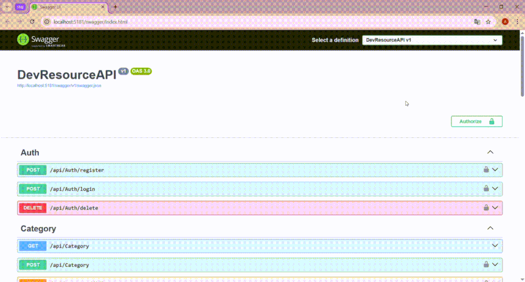
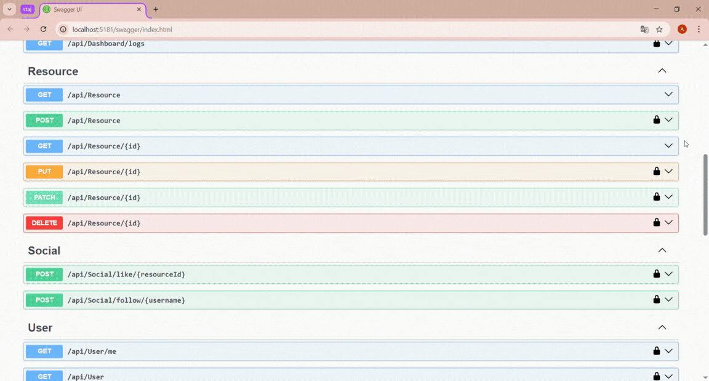
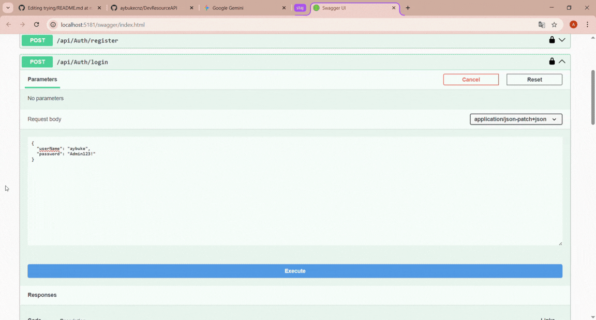

<div align="center">
  <a href="#-devresource-api-enterprise-backend-architecture-tr">
    
  </a>
  <a href="#-devresource-api-enterprise-backend-architecture-en">
    
  </a>
</div>

---

<a name="-devresource-api-enterprise-backend-architecture-tr"></a>
#  DevResource API (Enterprise Backend Architecture)


> **[Click here for English Version 🇬🇧](#-devresource-api-enterprise-backend-architecture-en)**

**Yüksek Performanslı, Sosyal Etkileşimli ve Güvenli Kaynak Yönetim Altyapısı**

Bu proje, modern yazılım dünyasının ihtiyaç duyduğu **Data Integrity (Veri Bütünlüğü)**, **Social Graph (Sosyal Ağ Yapısı)** ve **Security (Güvenlik)** standartları gözetilerek geliştirilmiş, endüstri standardında bir Backend motorudur.

**API-First** yaklaşımıyla tasarlanan bu mimari; herhangi bir Web, Mobil veya Masaüstü uygulamasına (Frontend) servis sağlayabilecek, sunum katmanından bağımsız (Headless) güçlü bir altyapı sunar.

---

##  İçindekiler
- [Mimari Vizyon](#-mimari-vizyon)
- [ Canlı Demo (Özellik Vitrini)](#-canlı-demo-özellik-vitrini)
- [ Güvenlik ve Yetkilendirme](#️-güvenlik-ve-yetkilendirme)
- [ Veri Bütünlüğü ve İş Kuralları](#-veri-bütünlüğü-ve-iş-kuralları)
- [ Teknoloji Yığını](#-teknoloji-yığını)
- [ Kurulum](#-kurulum)

---

##  Mimari Vizyon

DevResource API, klasik CRUD operasyonlarının ötesine geçen bir **SaaS (Hizmet Olarak Yazılım)** altyapısıdır. Geliştiricilerin teknik kaynaklarını güvenle saklamasını, paylaşmasını ve **Sosyal Ağ** mantığıyla (Takip/Beğeni) etkileşime girmesini sağlar.

* **Fault-Tolerant:** Hataları zincirleme reaksiyona sokmadan yakalayan Global Exception Handler.
* **Audit Trail:** Kimin ne zaman ne yaptığını takip eden loglama altyapısı.
* **Scalable:** Büyük veri setleri için sunucu taraflı sayfalama (Pagination) optimizasyonu.

---

##  Canlı Demo (Özellik Vitrini)

### 1. Rol Tabanlı Güvenlik Duvarı (RBAC)
Sistem "Sıfır Güven" (Zero Trust) prensibiyle çalışır.
* **Unauthorized (401):** Kimliksiz erişim denemeleri reddedilir.
* **Forbidden (403):** Standart kullanıcılar, başkasının verisine müdahale edemez. Sadece **Admin** tam yetkiye sahiptir.



### 2. Validasyon ve Veri Güvenliği
Hatalı veri girişleri veritabanına ulaşmadan engellenir.
* **Input Validation:** `FluentValidation` ile geçersiz veriler (Boş başlık, bozuk URL) anında reddedilir.
* **Soft Delete:** Veriler asla fiziksel olarak silinmez; "Geri Dönüşüm Kutusu" mantığıyla arşivlenir (`IsDeleted=true`).
* **Pagination:** Büyük veri setleri performanslı şekilde listelenir.



### 3. Sosyal Etkileşim ve İş Mantığı (Business Logic)
Sistem yaşayan bir sosyal ağdır.
* **Social Graph:** Kullanıcılar kaynakları beğenebilir ve diğer geliştiricileri takip edebilir.
* **Logic Checks:** *"Kullanıcı kendini takip edemez"* veya *"Aynı kaynağı iki kere beğenemez"* gibi mantıksal kurallar API seviyesinde korunur.



---

##  Güvenlik ve Yetkilendirme

Kritik sektörlerin (Fintech, Savunma Sanayii) standartlarına uygun koruma mekanizmaları.

* **Identity & JWT:** ASP.NET Core Identity ile güvenli parola saklama (Hashing) ve Stateless oturum yönetimi.
* **API Key Middleware:** 3. Parti servis entegrasyonları için ekstra güvenlik katmanı.
* **Secure Extensions:** `User.GetUserId()` gibi güvenli metodlarla kimlik okuma işlemleri standardize edildi.

---

##  Veri Bütünlüğü ve İş Kuralları

* **Restrict Delete Prensibi:** İlişkisel bütünlüğü korumak için, içerisinde aktif veri barındıran üst kategorilerin silinmesi engellenmiştir.
* **Global Query Filters:** Silinen veriler (`Soft Delete`) tüm sistem genelindeki sorgulardan otomatik olarak filtrelenir.
* **Transactional Integrity:** Sosyal etkileşimlerde (Takip/Beğeni) veri tutarlılığı sağlanır.

---

##  Teknoloji Yığını

| Alan | Teknoloji | Kullanım Amacı |
| :--- | :--- | :--- |
| **Core** | .NET 9.0 | Backend Framework |
| **Data** | PostgreSQL & EF Core | Veritabanı ve ORM |
| **Loglama** | Serilog | Yapısal Loglama (File/Console) |
| **Validasyon** | FluentValidation | Model Doğrulama |
| **Security** | Identity & JWT | Kimlik Yönetimi |
| **Testing** | xUnit | Birim Testleri (InMemory DB) |
| **Docs** | Swagger / OpenAPI | API Test Arayüzü |

---

##  Kurulum

Projeyi yerel ortamınızda çalıştırmak için:

1.  **Repoyu Klonlayın**
    ```bash
    git clone [https://github.com/aybukecnz/DevResourceAPI.git](https://github.com/aybukecnz/DevResourceAPI.git)
    cd DevResourceAPI
    ```

2.  **Veritabanı Ayarı**
    `appsettings.json` dosyasındaki Connection String alanını kendi yerel PostgreSQL sunucunuza göre düzenleyin.

3.  **Başlatın (Auto-Seed)**
    ```bash
    dotnet restore
    dotnet run
    ```
    > **Not:** `DbSeeder` servisi sayesinde, proje ilk ayağa kalktığında `Admin` kullanıcısı ve örnek veriler **otomatik olarak yüklenir.**

4.  **Test Edin**
    Tarayıcıda `https://localhost:7082/swagger` adresine gidin.

---

<a name="-devresource-api-enterprise-backend-architecture-en"></a>
#  DevResource API (Enterprise Backend Architecture)


> **[Türkçe Versiyon için Tıklayın 🇹🇷](#-devresource-api-enterprise-backend-architecture-tr)**

**High-Performance, Socially Interactive, and Secure Resource Management Infrastructure**

This project is an industry-standard Backend engine developed with **Data Integrity**, **Social Graph**, and **Security** standards in mind, addressing the needs of the modern software world.

Designed with an **API-First** approach, this architecture offers a robust, **Headless** infrastructure capable of serving any Web, Mobile, or Desktop application (Frontend).

---

##  Table of Contents
- [Architectural Vision](#-architectural-vision)
- [ Live Demo (Feature Showcase)](#-live-demo-feature-showcase)
- [ Security & Authorization](#️-security--authorization)
- [ Data Integrity & Business Rules](#-data-integrity--business-rules)
- [ Tech Stack](#-tech-stack)
- [ Installation](#-installation)

---

##  Architectural Vision

DevResource API is a **SaaS (Software as a Service)** infrastructure that goes beyond classic CRUD operations. It allows developers to securely store and share technical resources while interacting through a **Social Graph** (Follow/Like) logic.

* **Fault-Tolerant:** A Global Exception Handler that catches errors without triggering chain reactions.
* **Audit Trail:** A logging infrastructure that tracks who did what and when.
* **Scalable:** Server-side pagination optimization for handling large datasets.

---

##  Live Demo (Feature Showcase)

### 1. Role-Based Security Firewall (RBAC)
The system operates on a "Zero Trust" principle.
* **Unauthorized (401):** Unauthenticated access attempts are rejected.
* **Forbidden (403):** Standard users cannot interfere with others' data. Only **Admins** have full privileges.


### 2. Validation and Data Security
Incorrect data inputs are blocked before reaching the database.
* **Input Validation:** Invalid data (e.g., empty titles, malformed URLs) is immediately rejected via `FluentValidation`.
* **Soft Delete:** Data is never physically deleted; it is archived using a "Recycle Bin" logic (`IsDeleted=true`).
* **Pagination:** Large datasets are listed with high performance.


### 3. Social Interaction & Business Logic
The system acts as a living social network.
* **Social Graph:** Users can like resources and follow other developers.
* **Logic Checks:** Logical rules like *"A user cannot follow themselves"* or *"Cannot like the same resource twice"* are protected at the API level.


---

##  Security & Authorization

Protection mechanisms complying with critical sector (Fintech, Defense Industry) standards.

* **Identity & JWT:** Secure password hashing and Stateless session management with ASP.NET Core Identity.
* **API Key Middleware:** Extra security layer for 3rd party service integrations.
* **Secure Extensions:** Identity reading operations standardized with secure methods like `User.GetUserId()`.

---

##  Data Integrity & Business Rules

* **Restrict Delete Principle:** To preserve relational integrity, deleting parent categories containing active data is prevented.
* **Global Query Filters:** Deleted data (`Soft Delete`) is automatically filtered out from system-wide queries.
* **Transactional Integrity:** Data consistency is ensured during social interactions (Follow/Like).

---

##  Tech Stack

| Area | Technology | Purpose |
| :--- | :--- | :--- |
| **Core** | .NET 9.0 | Backend Framework |
| **Data** | PostgreSQL & EF Core | Database & ORM |
| **Logging** | Serilog | Structured Logging (File/Console) |
| **Validation** | FluentValidation | Model Validation |
| **Security** | Identity & JWT | Identity Management |
| **Testing** | xUnit | Unit Tests (InMemory DB) |
| **Docs** | Swagger / OpenAPI | API Test Interface |

---

##  Installation

To run the project in your local environment:

1.  **Clone the Repo**
    ```bash
    git clone [https://github.com/aybukecnz/DevResourceAPI.git](https://github.com/aybukecnz/DevResourceAPI.git)
    cd DevResourceAPI
    ```

2.  **Database Configuration**
    Update the Connection String in `appsettings.json` according to your local PostgreSQL server.

3.  **Start (Auto-Seed)**
    ```bash
    dotnet restore
    dotnet run
    ```
    > **Note:** Thanks to the `DbSeeder` service, the **Admin** user and sample data are **automatically loaded** when the project first starts.

4.  **Test It**
    Go to `https://localhost:7082/swagger` in your browser.

